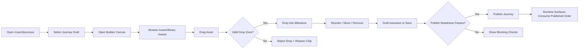

# W12 Drag/Drop Library-to-Journey Spec

## Purpose
Provide an implementation-ready spec for coach-portal authoring where content from Library is dragged into Journey Builder, with explicit UX behavior, data model needs, contract mapping, and phased delivery.

## Scope and Guardrails
- Docs/control-plane only.
- No net-new endpoint family.
- No schema-breaking changes in this assignment.
- Coach is primary authoring persona.
- Team Leader capabilities are team-scoped only (no org-wide authoring ownership).
- Challenge Sponsor is sponsor-scoped only.
- Sponsor has no KPI logging/edit actions.
- `/admin/coaching/audit` remains secondary governance/troubleshooting only.

## Target Surfaces
- Authoring routes:
  - `/coach/library`
  - `/coach/journeys`
  - `/coach/uploads`
- Runtime validation surfaces:
  - `coaching_journeys`
  - `coaching_journey_detail`
  - `coaching_lesson_detail`

## UX Baseline (Intuitive/High-Signal)
- Direct manipulation first: drag cards, visible drop zones, insertion indicator, immediate visual confirmation.
- Low-friction hierarchy: library on left, journey canvas center, item inspector right.
- Progressive disclosure: advanced controls hidden until item is selected.
- Fast confidence loops: autosave indicator, undo affordance, publish-readiness badge always visible.
- Clean boundaries: role-denied controls are visible but locked with clear reason text.

## UX Flow Map



## Interaction State Matrix

| State | Trigger | UI Behavior | Persistence Impact | Error/Fallback |
|---|---|---|---|---|
| `drag_idle` | no active drag | cards static, handles visible on hover/focus | none | n/a |
| `drag_start` | pick up card | ghost card + origin highlight | none | cancel returns to `drag_idle` |
| `drag_hover_valid` | dragged item over compatible zone | drop zone glow + insertion line | none | n/a |
| `drag_hover_invalid` | dragged item over incompatible zone | red outline + reason chip | none | drop blocked |
| `drop_commit` | release on valid zone | card inserted; canvas animates to new order | staged draft op queued | failure moves to `save_error` |
| `reorder` | move within milestone or across milestones | positional swap animation + index badge update | staged draft op queued | conflict fallback to `draft_conflict` |
| `remove` | remove action on placed card | card fades out + undo toast | staged draft op queued | restore via undo if available |
| `save_pending` | autosave or manual save starts | status chip `Saving...` | sends draft ops batch | timeout -> `save_error` |
| `save_success` | draft ops acknowledged | status chip `Saved` + timestamp | server draft version advanced | n/a |
| `save_error` | save request fails | inline error + retry CTA | no version advance | retry or refresh draft |
| `draft_conflict` | stale version/write race | blocking banner + diff/reload options | requires rebase/reload | preserve local op queue for retry |

## Required Frontend Data Model

```ts
export type ScopeType = 'org' | 'team' | 'sponsor';
export type LibraryItemType = 'lesson' | 'module' | 'template' | 'asset';

export interface LibraryItem {
  id: string;
  title: string;
  itemType: LibraryItemType;
  scopeType: ScopeType;
  scopeId: string | null;
  sponsorScoped: boolean;
  tags: string[];
  estimatedMinutes?: number;
  status: 'active' | 'archived';
}

export interface JourneyMilestoneBlock {
  blockId: string;
  libraryItemId: string;
  milestoneId: string;
  orderIndex: number;
  required: boolean;
}

export interface JourneyDraft {
  journeyId: string;
  draftVersion: number;
  milestones: Array<{
    milestoneId: string;
    title: string;
    blocks: JourneyMilestoneBlock[];
  }>;
  dirty: boolean;
  saveState: 'idle' | 'pending' | 'success' | 'error' | 'conflict';
  publishReadiness: {
    status: 'ready' | 'blocked';
    checks: Array<{ code: string; severity: 'error' | 'warning'; message: string }>;
  };
}

export interface JourneyDraftOp {
  opId: string;
  type: 'add' | 'move' | 'reorder' | 'remove';
  blockId?: string;
  libraryItemId?: string;
  fromMilestoneId?: string;
  toMilestoneId?: string;
  toIndex?: number;
  actorRole: 'coach' | 'admin' | 'team_leader' | 'sponsor';
  clientTimestamp: string;
}

export interface ActionCapabilities {
  canComposeDraft: boolean;
  canPublish: boolean;
  canMoveAcrossScopes: boolean;
  denialReason?: string;
}
```

## API Contract Mapping (Existing)

| UX Need | Existing contract | Current fit |
|---|---|---|
| Journey read for builder baseline | `GET /api/coaching/journeys`, `GET /api/coaching/journeys/{id}` | partial (read exists; draft structure not explicit) |
| Runtime lesson progress | `POST /api/coaching/lessons/{id}/progress` | sufficient for runtime, not authoring |
| Context distribution after publish | `/api/channels*`, `POST /api/coaching/broadcast` | partial, publish integration not formalized |
| Sponsor context visibility | `GET /sponsored-challenges*` | partial, authoring link metadata not explicit |
| Coach assist copy (advisory only) | `/api/ai/suggestions*` | optional support for draft-copy suggestions |

## Explicit Contract Gaps (In-Family Only)

| Gap ID | Required capability | Proposed in-family extension | Rationale |
|---|---|---|---|
| G1 | Library payload normalized for drag source | `GET /api/coaching/library` OR add `library_items` to journey detail payload | Builder needs stable card metadata and scope labels |
| G2 | Draft operation writes for add/move/reorder/remove | `POST /api/coaching/journeys/{id}/draft/ops` | Deterministic operation-log model, auditable changes |
| G3 | Draft fetch with versioning | `GET /api/coaching/journeys/{id}/draft` | Required for conflict handling and resume |
| G4 | Publish readiness and publish action | `GET /api/coaching/journeys/{id}/publish-readiness`, `POST /api/coaching/journeys/{id}/publish` | Prevent invalid publish and keep checks server-authoritative |
| G5 | Action capability metadata by role/scope | `action_capabilities` additive object on coaching responses | Prevent client-side policy inference |

## Contract Boundary Notes
- All new authoring operations stay in `/api/coaching/*` family.
- No net-new endpoint family for drag/drop workflow.
- Runtime mobile/member surfaces consume published output only.
- Team Leader write scope remains own-team only.
- Sponsor remains read/link scoped with no KPI logging/edit routes.

## Role Gate Matrix

| Persona | Browse library | Drag/drop compose | Publish | KPI logging in this flow |
|---|---|---|---|---|
| Coach | yes | yes | yes | no |
| Admin operator | yes | governance-assist only | yes (policy-gated) | no |
| Team Leader | yes (team-scoped items) | team-scoped only (if enabled) | no org-wide authority | no |
| Challenge Sponsor | yes (sponsor scope) | no default draft authoring | no | no |

## Phased Build Plan

### Phase 1: MVP (functional drag/drop authoring)
- Builder shell on `/coach/journeys` with drag source from `/coach/library`.
- Add/move/reorder/remove interactions.
- Draft save indicator and retry path.
- Basic role-gated denied states.
- In-family contract slices: G1, G2, G3.

### Phase 2: Hardening (publish and policy confidence)
- Publish readiness panel with blocking checks.
- Server-authoritative publish endpoint integration.
- Conflict resolution UX (`draft_conflict`) and version recovery.
- In-family contract slices: G4, G5.

### Phase 3: Polish (sexy/intuitive finish)
- Refined motion timing for drag hover/drop/reorder.
- Keyboard parity polish and reduced-motion treatment.
- Multi-select bulk move and undo stack quality pass.
- Optional AI assist insertion for draft-copy only (`/api/ai/suggestions*`, advisory).

## Build Steps (Implementation Checklist)
1. Add builder information architecture contract for `/coach/library` + `/coach/journeys`.
2. Implement frontend draft model and op queue (`JourneyDraft`, `JourneyDraftOp`).
3. Wire drag lifecycle to queued draft ops and save states.
4. Enforce role/scope gates from `action_capabilities` (or temporary conservative client deny until available).
5. Add publish-readiness and publish action wiring.
6. Validate runtime result consistency on `coaching_journeys*` surfaces.

## Validation for This Assignment
- Route/surface alignment verified against:
  - `/Users/jon/compass-kpi/app/screens/AdminShellScreen.tsx`
  - `/Users/jon/compass-kpi/app/screens/KPIDashboardScreen.tsx`
- Contract boundary verified against:
  - `/Users/jon/compass-kpi/docs/spec/04_api_contracts.md`
- No new endpoint family required by this spec.
