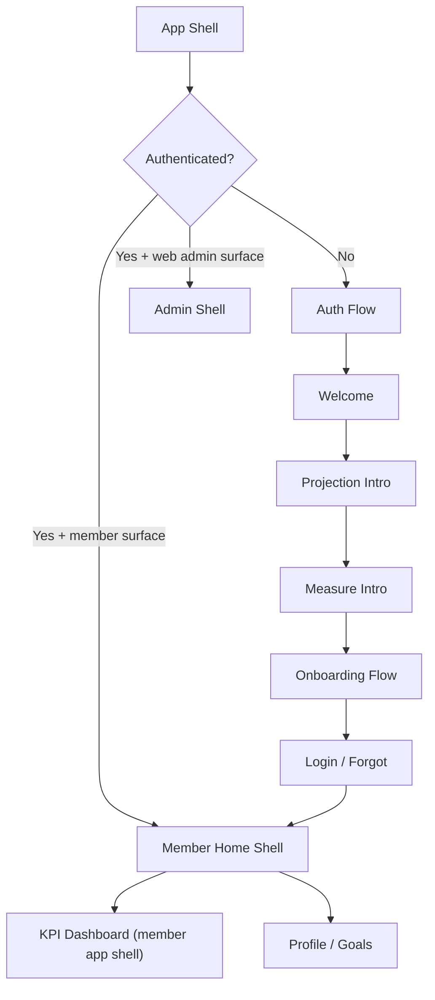
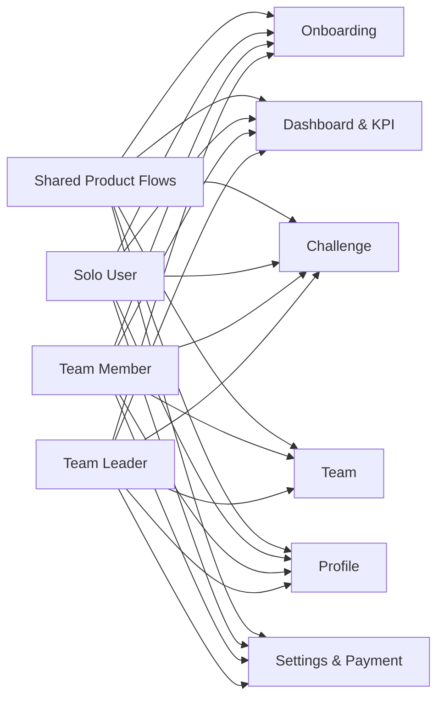
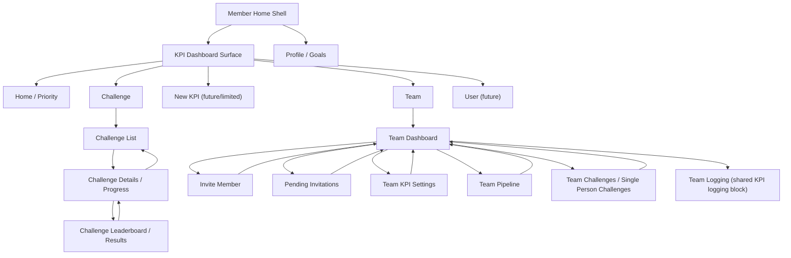
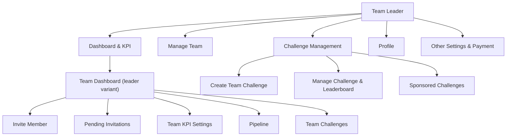
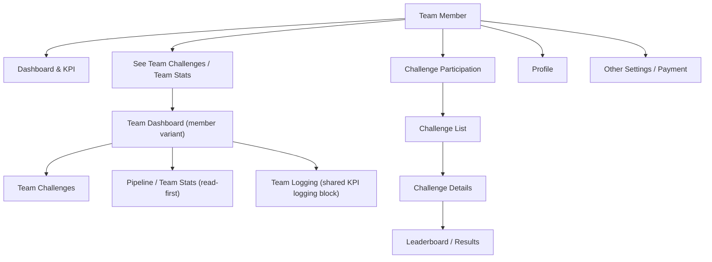
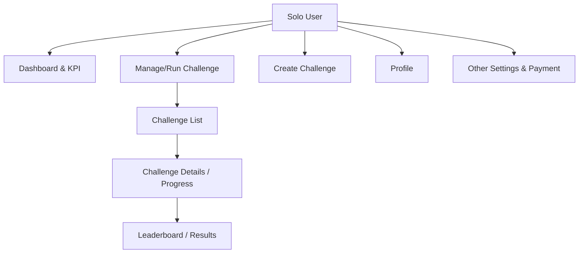

# Intended Wiring Diagram (Persona + Flow)

## Purpose
Provide a high-level wiring diagram for the **intended app navigation and flow structure**, organized by persona and aligned to Figma flow groupings.

This is a planning diagram, not a literal runtime router definition.

Use with:
- `/Users/jon/compass-kpi/docs/spec/appendix/INTENDED_PERSONA_FLOW_SCREENMAP.md`
- `/Users/jon/compass-kpi/docs/spec/appendix/FIGMA_BUILD_MAPPING.md`

## Key Principles
- Organize by **persona perspective** (`Solo User`, `Team Member`, `Team Leader`)
- Reuse **shared flows/screens** where possible
- Track persona-specific deltas at the screen/CTA level, not by forking the app architecture
- Current runtime implementation is state-driven (not React Navigation), so this diagram describes **intended behavior**

## Global App Entry (Current + Intended)

## Persona Model (Intended)

## Member App Shell (Intended)

This maps to the current `KPIDashboardScreen` state router and its nested subflows.

## Team Leader Perspective (Intended)

Primary implementation focus right now.

## Team Member Perspective (Intended)

Focuses on participation and visibility, with fewer management controls.

## Solo User Perspective (Intended)

Team management routes are excluded; challenge flow remains central.

## Team Flow Canonical Screen Wiring (Current Active Parity Program)

Use these exact references for active Team implementation work:

| Screen | Canonical node | Export | Current runtime status |
|---|---:|---|---|
| Team Dashboard | `173-29934` | `team_dashboard_v1.png` | `partial` (active parity chunk) |
| Invite Member | `173-4448` | `team_invite_member_v1.png` | `stub` |
| Pending Invitations | `173-4612` | `team_pending_invitations_v1.png` | `stub` |
| Team KPI Settings | `173-4531` | `team_kpi_settings_v1.png` | `stub` |
| Pipeline | `168-16300` | `team_pipeline_v1.png` | `stub` |
| Single Person Challenges / Team Challenges | `173-4905` | `team_single_person_challenges_v1.png` | `stub` |

## Current Runtime Router Reality (Implementation Constraint)

The current member app does not use a formal navigation library for these flows. It uses state routers in:
- `/Users/jon/compass-kpi/app/screens/HomeScreen.tsx`
- `/Users/jon/compass-kpi/app/screens/KPIDashboardScreen.tsx`

Current nested routing state:
- bottom tabs: `home`, `challenge`, `newkpi`, `team`, `user`
- challenge subflow: `list`, `details`, `leaderboard`
- team subflow: `dashboard`, `invite_member`, `pending_invitations`, `kpi_settings`, `pipeline`, `team_challenges`

## Next Diagram Update Trigger
Update this doc whenever:
- a new Team or Challenge screen becomes navigable
- a canonical Figma node changes
- persona-specific deltas become explicit in runtime (leader vs member variants)
- the app moves from state-router navigation to a formal navigator

