# Intended Wiring Diagram (Persona + Flow)

## Purpose
Provide a high-level wiring diagram for the **intended app navigation and flow structure**, organized by persona and aligned to Figma flow groupings.

This is a planning diagram, not a literal runtime router definition.

Use with:
- `/Users/jon/compass-kpi/docs/spec/appendix/INTENDED_PERSONA_FLOW_SCREENMAP.md`
- `/Users/jon/compass-kpi/docs/spec/appendix/FIGMA_BUILD_MAPPING.md`
- `/Users/jon/compass-kpi/docs/spec/appendix/COACHING_CAPABILITY_AND_PERSONA_MATRIX.md`
- `/Users/jon/compass-kpi/docs/spec/appendix/COACHING_WIRING_ADDENDUM.md`

## Maintenance Rule (Required)
This doc and `/Users/jon/compass-kpi/docs/spec/appendix/INTENDED_PERSONA_FLOW_SCREENMAP.md` must be updated **in the same change set** whenever:
- a screen is added/removed/renamed
- wiring/transitions change
- status colors/badges change (`⚪/🔵/🟡/🟢/🔴`)
- persona access or flow ownership changes

## Key Principles
- Organize by **persona perspective** (`Solo User`, `Team Member`, `Team Leader`) plus role-gated ops companions (`Coach`, `Challenge Sponsor`) where needed
- Reuse **shared flows/screens** where possible
- Track persona-specific deltas at the screen/CTA level, not by forking the app architecture
- Model coaching as a cross-cutting capability layer (embedded modules + dedicated flows)
- Current runtime implementation is state-driven (not React Navigation), so this diagram describes **intended behavior**

## Visual Status Legend (Node + Wiring)

Node color meanings (for key screens/modules in diagrams below), using a conventional delivery-status palette:
- `⚪` Not started / not existing yet (intended only)
- `🔵` MVP complete (working, usable baseline)
- `🟡` Framed/existing (partial, stub, or parity pending)
- `🟢` Production ready
- `🔴` Blocked / broken (reserved for regressions or active blockers)

Wiring line meanings:
- `-->` solid arrow = successful/currently wired (or validated route shell)
- `-.->` dashed arrow = intended/planned wiring (not fully implemented)

```mermaid
flowchart LR
  A["🔵 MVP Complete"] --> B["Solid = wired"]
  C["🟢 Production Ready"] --> D["Dashed = planned/intended"]
  E["🟡 Framed / Existing"]
  F["⚪ Not Started / Missing"]
  G["🔴 Blocked / Broken"]

  classDef mvp fill:#dbeafe,stroke:#2563eb,color:#1e3a8a,stroke-width:2px;
  classDef prod fill:#dcfce7,stroke:#16a34a,color:#14532d,stroke-width:2px;
  classDef framed fill:#fef9c3,stroke:#ca8a04,color:#713f12,stroke-width:2px;
  classDef missing fill:#f3f4f6,stroke:#9ca3af,color:#111827,stroke-width:2px;
  classDef blocked fill:#fee2e2,stroke:#dc2626,color:#7f1d1d,stroke-width:2px;
  class A mvp;
  class C prod;
  class E framed;
  class F missing;
  class G blocked;
```

## Global App Entry (Current + Intended)

## Persona Model (Intended)

## Coaching / Communication Overlay (Intended)

Coaching is a capability layer across Team, Challenge, Home, and Profile, plus new dedicated flows.

```mermaid
flowchart TD
  CC["🟡 Coaching / Communication Layer (planning active)"] --> CC1["⚪ Inbox / Channels (dedicated)"]
  CC --> CC2["⚪ Coaching Journeys (dedicated)"]
  CC --> CC3["⚪ Embedded Coaching Modules"]

  CC3 --> CC3A["⚪ Home / Priority nudges"]
  CC3 --> CC3B["⚪ Team Dashboard coaching summary / broadcast preview"]
  CC3 --> CC3C["⚪ Challenge Details coaching + sponsor campaign blocks"]
  CC3 --> CC3D["⚪ Profile / goals / coaching prefs"]

  CC1 -.-> CCT["⚪ Team channel"]
  CC1 -.-> CCC["⚪ Challenge channel"]
  CC1 -.-> CCS["⚪ Sponsor channel"]
  CC1 -.-> CCB["⚪ Broadcast composer (leader/admin role-gated)"]

  CC2 -.-> J1["⚪ Journey list"]
  CC2 -.-> J2["⚪ Journey detail"]
  CC2 -.-> J3["⚪ Lesson detail / progress"]
```

## Coaching Insert Points and Destination Status (W1/W2 Planning)

Manual-spec-driven planning only (no Figma-backed coaching screens identified in this pass).

| Hosting surface / module | Persona(s) | Capability group | Destination / route intent | W1 status | W2 status | Entry point intent | Notes |
|---|---|---|---|---|---|---|---|
| Home / Priority coaching nudge | Team Leader, Team Member, Solo User | `goal_setting_momentum`, `coaching_content` | `coaching_journeys` (primary), `inbox` (secondary optional) | `🟡 stub` | `🟡 recommended` | embedded nudge card CTA | W1 placeholder CTA shell added in `KPIDashboardScreen` home surface; runtime package visibility banner/fallback state now shown when entitlement outcomes are not present. |
| Team Dashboard leader coaching summary / broadcast preview | Team Leader | `communication`, `coaching_content` | `coach_broadcast_compose`, `coaching_journeys`, `inbox_channels` | `🟡 stub` | `🟡 partial` | embedded module CTAs | W2 routes leader Team Dashboard CTAs into team-scoped `inbox_channels` and role-gated `coach_broadcast_compose` shell context; runtime package visibility banner/fallback added and CTA disable is reserved for explicit server gated/blocked outcomes. |
| Team Dashboard member coaching progress / updates | Team Member | `communication`, `coaching_content` | `coaching_journeys`, `inbox_channels` | `🟡 stub` | `🟡 partial` | embedded module CTAs | W2 routes Team Member updates CTA into team-scoped `inbox_channels`; runtime package visibility banner/fallback added while journeys payloads remain package-outcome sparse. |
| Challenge Details / Results coaching block | Team Leader, Team Member, Solo User | `sponsor_challenge_coaching`, `communication` | `inbox_channels`, `channel_thread`, `coaching_journey_detail` | `🟡 stub` | `🟡 partial` | challenge detail CTA/link block | W2 routes Challenge Updates CTA into context-scoped `channel_thread` (challenge/sponsor shell context). Challenge payload ownership remains separate; challenge coaching CTA block now surfaces sponsored-vs-paid boundary fallback/gating copy. |
| Profile / Settings coaching prefs / notifications | Team Leader, Team Member, Solo User | `goal_setting_momentum`, `communication` | `inbox`, profile prefs subsection (manual-spec-driven) | `🟡 stub` | `🟡 recommended` | settings CTA / subsection | W1 placeholder prefs/notifications allocation implemented inside `user` coaching shell surface. |
| Inbox / Channels dedicated flow | Team Leader, Team Member, Solo User | `communication` | `inbox`, `inbox_channels`, `channel_thread` | `🟡 stub` | `🟡 partial` | dedicated flow shell | W4 adds API-backed channel list fetch (`GET /api/channels`), thread reads (`GET /api/channels/{id}/messages`), message send (`POST /api/channels/{id}/messages`), and mark-seen (`POST /api/messages/mark-seen`) with context-aware filtering/fallbacks. Runtime package visibility banners/fallback states are now rendered; blocked/gated action disable depends on explicit server outcomes. |
| Broadcast composer (leader/admin role-gated) | Team Leader (Admin/Coach later per DEP-003) | `communication` | `coach_broadcast_compose` | `🟡 stub` | `🟡 partial` | Team Dashboard + Inbox role-gated CTA | W4 wires leader broadcast send via `/api/channels/{id}/broadcast` (channel-based path) with UI role gating + API error handling; server remains source of permission/throttle enforcement. Package visibility gating banners are UI-only until explicit entitlement outcomes are provided. |
| Coaching Journeys dedicated flow | Team Leader, Team Member, Solo User | `coaching_content` | `coaching_journeys`, `coaching_journey_detail`, `coaching_lesson_detail` | `🟡 stub` | `🟡 partial` | Home/Team/Challenge embedded CTA | W3 wires API-backed journeys list/detail and explicit lesson progress actions (`GET /api/coaching/journeys*`, `GET /api/coaching/progress`, `POST /api/coaching/lessons/{id}/progress`); no KPI logging writes and no auto-complete on view. Runtime package visibility banners/fallback states now surface entitlement contract gaps without local policy inference. |

## W7 Coach Portal Foundation Overlay (Intended, Manual-Spec-Driven)

Coach persona planning is modeled as an authoring/ops companion layer (admin-web extension or hybrid portal), not a member runtime fork.

```mermaid
flowchart LR
  CA["🟡 Coach/Admin Authoring Layer (planning active)"] --> CL["⚪ Coach Content Library"]
  CA --> JA["⚪ Journey Authoring Studio"]
  CA --> PT["⚪ Publishing & Targeting"]
  CA --> PE["⚪ Packages / Entitlements"]
  CA --> OA["⚪ Ops Audit / Approvals"]

  PT -.-> RD["🟡 Runtime Delivery Assignments (published metadata)"]
  PE -.-> RD
  RD --> RJ["🟡 Coaching Journeys (member runtime)"]
  RD --> RC["🟡 Challenge Coaching Overlays"]
  RD --> RT["🟡 Team Coaching Modules"]
  RD --> RI["🟡 Inbox / Channels context routing"]
```

## W7 Coach Authoring / Packaging Touchpoints and Handoff Status

| Authoring/ops surface | Persona(s) | Capability group(s) | Handoff target (runtime) | Status | Boundary note |
|---|---|---|---|---|---|
| Library Upload Intake (`coach_content_library` capability) | Coach, Admin operator, Team Leader (team-scoped uploads only), Challenge Sponsor (limited sponsor campaign uploads) | `coaching_content`, sponsor campaign assets | `coach_content_library` ingestion -> runtime linked content/templates | `⚪ planned` | Upload intake is subsumed within Library and is not a first-class coach tab. Team Leader uploads are own-team scoped (no org-wide authoring ownership, no sponsor package authority); no KPI logging/edit actions. |
| Coach Content Library (`coach_content_library`) | Coach, Admin operator, Challenge Sponsor (limited sponsor-scoped access/linking) | `coaching_content`, `communication` templates | `coaching_journeys*`, `inbox*` template usage | `⚪ planned` | Authoring/curation only; runtime delivery never edits canonical content here. Sponsor access is scope-limited to sponsor campaign contexts and does not grant KPI logging actions. |
| Journey Authoring Studio (`coach_journey_authoring`) | Coach | `coaching_content` | `coaching_journeys*` published journey versions | `⚪ planned` | Draft/review/publish lifecycle is ops concern, not member runtime concern. |
| Cohorts / Audience Segments (`cohorts`) | Coach, Admin operator, Challenge Sponsor (limited sponsor scopes) | targeting/visibility planning (`communication`, `sponsor_challenge_coaching`) | runtime cohort-based channels + package targeting inputs | `⚪ planned` | Cohort visibility/constraints only; no challenge participation ownership or KPI logging actions. |
| Channel Operations (`channels`) | Coach, Admin operator, Challenge Sponsor (limited sponsor scopes) | `communication` | complements runtime `inbox_channels` / `channel_thread` channel context ops | `⚪ planned` | Portal channel ops complement coach runtime operator workflows; sponsor access is comms-only and sponsor-scoped. |
| Publishing & Targeting (`coach_publish_targeting`) | Coach, Admin operator, Challenge Sponsor (limited sponsor scopes) | `communication`, `sponsor_challenge_coaching` | Team/Challenge/Profile overlays + `inbox*` + `coaching_journeys*` | `⚪ planned` | Produces targeting/assignment metadata; must not rewrite challenge participation state or grant sponsor KPI logging. |
| Coaching Packages / Entitlements (`coach_packages_entitlements`) | Admin operator, Coach (limited), Challenge Sponsor (limited sponsor scopes) | `sponsor_challenge_coaching`, paid packaging | Runtime visibility/entitlement gating | `⚪ planned` | Packaging/access logic separated from journey authoring and runtime rendering; sponsor access is sponsor-scoped only. |
| Coach Ops Audit / Approvals (`coach_ops_audit`) | Admin operator | `communication`, `coaching_content` (+ `ai_coach_assist` later) | Policy constraints on runtime allowed actions | `🟡 partial` | Admin shell extension now provides approval-first AI suggestion moderation queue + audit detail companion UI; no direct KPI data mutation or execution actions. |

## W7 Coach Ops Portal Host Recommendation and Route Grouping (Planning)

Near-term recommendation: use `Admin Shell` as the host (role-gated extension routes) and defer a hybrid/dedicated coach portal until touchpoint complexity justifies a structural split.

| Route group (provisional) | Host | Touchpoint | Primary persona(s) | Status | Decision note |
|---|---|---|---|---|---|
| `admin/coaching/uploads` | `Admin Shell extension` (compatibility alias only) | `coach_content_library` (upload intake mode) | Coach, Admin operator, Team Leader (team-scoped uploads only), Challenge Sponsor (limited sponsor uploads) | `⚪ planned` | Not a first-class coach tab; resolve to Library upload intake route while preserving team/sponsor scope boundaries and policy gates. |
| `admin/coaching/library` | `Admin Shell extension` | `coach_content_library` | Coach, Admin operator, Challenge Sponsor (limited sponsor-scoped library access/linking) | `⚪ planned` | No structural split required; sponsor access is campaign-limited and does not grant canonical authoring ownership or KPI logging actions. |
| `admin/coaching/authoring` | `Admin Shell extension` | `coach_journey_authoring` | Coach | `⚪ planned` | No structural split required. |
| `admin/coaching/cohorts` | `Admin Shell extension` | `cohorts` | Coach, Admin operator, Challenge Sponsor (limited sponsor scopes) | `⚪ planned` | W7 foundation cohort targeting/visibility surface; supports non-team cohort contexts. |
| `admin/coaching/channels` | `Admin Shell extension` | `channels` | Coach, Admin operator, Challenge Sponsor (limited sponsor scopes) | `⚪ planned` | W7 foundation portal channel ops surface; complements runtime `inbox*`/`channel_thread`. |
| `admin/coaching/publishing` | `Admin Shell extension` | `coach_publish_targeting` | Coach, Admin operator, Challenge Sponsor (limited sponsor scopes) | `⚪ planned` | Keep sponsor inputs constrained to campaign packaging/targeting; no sponsor KPI logging actions. |
| `admin/coaching/packages` | `Admin Shell extension` | `coach_packages_entitlements` | Admin operator, Coach (limited), Challenge Sponsor (limited sponsor scopes) | `⚪ planned` | Packaging/entitlement policy layer; not runtime delivery authoring. |
| `admin/coaching/audit` | `Admin Shell extension` | `coach_ops_audit` | Admin operator | `🟡 partial` | Governance/audit touchpoint implemented in admin shell as W5 AI queue/detail companion surface (stub-safe UI pending backend queue shaping). |

Hybrid/dedicated coach portal remains a deferred option and is `decision needed` in implementation if adopted (requires `DECISIONS_LOG.md` update for route/module boundary change).

W7/W8 checklist alignment:
- Implementation-ready Admin Web, Mobile Runtime, and Backend acceptance checklists live in `/Users/jon/compass-kpi/docs/spec/appendix/COACHING_WIRING_ADDENDUM.md`.
- W8 package/flow sequencing for portal + runtime handoff is defined in the same addendum.
- Final W8 implementation acceptance pack (lane done/blocked/rollback criteria + owner checkpoint checklist) is defined in the same addendum.
- W9 dedicated coach portal IA/UX direction and migration path are defined in the same addendum; `/admin/coaching/*` remains transition-host foundation during migration.
- W9 production-direction rule: dedicated coach portal experience is the target UX; admin-hosted routes are migration infrastructure, not final presentation model.
- Team Leader role in this package is constrained to team-scoped upload actions inside `coach_content_library` only (no org-wide authoring ownership, no sponsor package authority).
- Coach portal primary IA uses top-tab navigation only (`library`, `journeys`, `cohorts`, `channels`); sequential helper-button patterns are out of scope for primary navigation.
- Drag `Library -> Journey` is the primary authoring interaction target for coach content composition.
- `/admin/coaching/audit` remains secondary governance/troubleshooting and is not modeled as primary workflow routing.

## Authoring -> Runtime Publishing Handoff Rules (Planning Boundary)

- Runtime coaching surfaces (`coaching_journeys*`, challenge overlays, team modules, `inbox*`) consume published assignments and content metadata only.
- Authoring/ops surfaces own:
  - draft/review/publish lifecycle
  - package composition (`team`, `sponsored`, `paid`)
  - targeting and activation windows
  - sponsor/admin approvals and rollback
- Sponsored challenge boundary remains unchanged:
  - challenge system owns participation/eligibility/results
  - coaching owns linked content/comms experiences
- `Challenge Sponsor` is a distinct persona for sponsor-scoped comms/content/member-KPI visibility and must not be modeled as a KPI-logging persona.
- Paid coaching entitlement decisions are package/access inputs to runtime delivery, not runtime journey authoring behavior.

## W5 AI Coach Assist Approval-First Overlay (Planning Boundary)

AI coach assist is a companion layer on top of coaching runtime and coach/admin ops surfaces. It is advisory-only in W5 and must route through human review/approval before any send/publish action.

### W5 AI insert-point map (planning)
| Host surface | Persona(s) | AI entry mode | W5 status | Boundary note |
|---|---|---|---|---|
| `channel_thread` | Team Leader (member later optional) | CTA to AI draft/rewrite review shell | `🟡 partial` | W5 UI shell proto adds approval-first AI draft/rewrite CTA + review modal; no direct AI send, human send uses existing channel message path after review. |
| `coach_broadcast_compose` | Team Leader (Coach/Admin later per `DEP-003`) | draft broadcast copy + review | `🟡 partial` | W5 UI shell proto adds approval-first AI draft CTA + human insert-to-composer path; audience/scope authority remains server-validated and AI cannot expand scope. |
| `coaching_lesson_detail` | Team Leader, Team Member, Solo User | lesson-context reflection prompt draft | `🟡 partial` | W5 UI shell proto adds advisory lesson-context AI draft CTA + review modal; no lesson progress or KPI writes. |
| `coaching_journeys*` | Team Leader, Team Member, Solo User | journey-context coaching suggestion CTA | `🟡 partial` | W5 UI shell proto adds journey/journey-detail AI suggestion draft CTAs into approval-first review modal; no send/publish path. |
| Team/Challenge coaching embedded modules | Team Leader (+ policy-limited challenge contexts) | embedded CTA -> AI review shell | `🟡 partial` | W5 UI shell proto adds AI draft review CTAs on approved Team/Challenge coaching modules only; preserves sponsored/challenge ownership boundaries and approval-first requirements. |
| `coach_ops_audit` (admin extension) | Coach, Admin operator | approval queue + audit detail | `🟡 partial` | Admin shell extension route `/admin/coaching/audit` now renders approval queue + audit detail/review UI (approve/reject/history workflows, approval-first/no autonomous send). |

## W6 Notifications + Coaching Overlay (Planning Boundary)

Notifications are a delivery/awareness layer across coaching/comms/AI surfaces. They must not mutate coaching progress, KPI logs, forecasts, challenge participation/results, or bypass W5 AI approval-first execution rules.

### W6 notification insertion-point map (planning)
| Surface / host | Persona(s) | Notification mode | W6 status | Boundary note |
|---|---|---|---|---|
| Home / Priority coaching nudge | Leader, Member, Solo | inline banners/cards + badge labels | `🟡 partial` | Runtime W6 member notifications now render fallback+read-model-driven coaching banners/badges with route-only taps (`coaching_journeys*` / `inbox`); no side-effect writes from notification display actions. |
| Team coaching modules | Leader, Member | embedded banners/badges + CTA | `🟡 partial` | Runtime W6 member/leader Team coaching modules now include notification banners/badges using coaching/channel/AI queue visibility signals; preserve KPI/team/coaching ownership seams. |
| Challenge coaching block | Leader, Member, Solo | banner/disclaimer + CTA | `🟡 partial` | Runtime W6 challenge coaching block now includes notification banner rows (challenge/sponsor/access-change classes) with route-only taps; sponsor/challenge eligibility + disclaimer rules remain server-owned. |
| `coaching_journeys*` / `coaching_lesson_detail` | Leader, Member, Solo | inline status banners/chips | `🟡 partial` | Runtime W6 notifications now render inline banners/chips on journey/journey-detail/lesson-detail surfaces using coaching progress/journey + local lesson status context; no progress mutation from notification display. |
| `inbox*` / `channel_thread` | Leader, Member, Solo | canonical list rows, badges, thread system rows | `🟡 partial` | Runtime W6 adds notification inbox rows, channel badges, and thread system notification rows using in-family `channels/messages/coaching` read-models + safe fallbacks; explicit double-counting avoidance remains a follow-up refinement. |
| profile/settings coaching prefs | Leader, Member, Solo | preference controls + summary labels | `⚪ planned` | Preference persistence family remains `decision needed`. |
| `coach_ops_audit` (admin extension) | Coach, Admin operator | queue badges/alerts + notification dispatch visibility companion | `⚪ planned` | Visibility first; no dispatch authority widening. |

## Member App Shell (Intended)

This maps to the current `KPIDashboardScreen` state router and its nested subflows.

## Team Leader Perspective (Intended)

Primary implementation focus right now.

## Team Member Perspective (Intended)

Focuses on participation and visibility, with fewer management controls.

## Solo User Perspective (Intended)

Team management routes are excluded; challenge participation flow remains central. Generic solo challenge creation is not modeled as a primary destination; if later supported, solo challenge creation routes through Sponsored Challenges policy-gated entry points.

```mermaid
flowchart TD
  S["Solo User"] --> SD["Dashboard & KPI"]
  S --> SC["Manage/Run Challenge"]
  S -.-> SCP["Sponsored Challenges (solo create route if enabled)"]
  S --> SP["Profile"]
  S --> SS["Other Settings & Payment"]

  SC --> SCL["Challenge List"]
  SCL --> SCD["Challenge Details / Progress"]
  SCD --> SCB["Leaderboard / Results"]
  SCD -.-> SCN["⚪ Solo coaching prompt / sponsored content block"]

  classDef mvp fill:#dbeafe,stroke:#2563eb,color:#1e3a8a,stroke-width:2px;
  classDef prod fill:#dcfce7,stroke:#16a34a,color:#14532d,stroke-width:2px;
  classDef framed fill:#fef9c3,stroke:#ca8a04,color:#713f12,stroke-width:2px;
  classDef missing fill:#f3f4f6,stroke:#9ca3af,color:#111827,stroke-width:2px;

  class SD,SC,SCL,SCD,SCB mvp;
  class SP,SS framed;
  class SCP,SCN missing;
```

## Sponsored Challenge + Coaching Overlap (Intended)

This is a deliberate overlap and should be implemented as linked modules, not a merged ownership model.

```mermaid
flowchart LR
  SCH["Sponsored Challenge"] --> SCP["Challenge Participation / Progress"]
  SCH --> SCM["Sponsor Metadata + CTA + Disclaimer"]
  SCH -.-> SCC["⚪ Sponsor/Challenge Channel (optional)"]
  SCH -.-> SCL["⚪ Coaching Content / Journey Link (optional)"]

  SCP --> KPI["KPI Logging (single source of activity truth)"]
  SCL --> CJ["Coaching Journeys / Lessons"]
  SCC --> INB["Inbox / Channels"]
```

## Team Flow Canonical Screen Wiring (Current Active Parity Program)

Use these exact references for active Team implementation work:

| Screen | Canonical node | Export | Current runtime status |
|---|---:|---|---|
| Team Dashboard | `173-29934` | `team_dashboard_v1.png` | `🟡 partial` (leader parity implemented; iterate visuals/data) |
| Invite Member | `173-4448` | `team_invite_member_v1.png` | `🟡 partial` |
| Pending Invitations | `173-4612` | `team_pending_invitations_v1.png` | `🟡 partial` |
| Team KPI Settings | `173-4531` | `team_kpi_settings_v1.png` | `🟡 partial` |
| Pipeline | `168-16300` | `team_pipeline_v1.png` | `🟡 partial` |
| Single Person Challenges / Team Challenges | `173-4905` | `team_single_person_challenges_v1.png` | `🟡 partial` |

## Current Runtime Router Reality (Implementation Constraint)

The current member app does not use a formal navigation library for these flows. It uses state routers in:
- `/Users/jon/compass-kpi/app/screens/HomeScreen.tsx`
- `/Users/jon/compass-kpi/app/screens/KPIDashboardScreen.tsx`

Current nested routing state:
- bottom tabs: `home`, `challenge`, `newkpi`, `team`, `user`
- challenge subflow: `list`, `details`, `leaderboard`
- team subflow: `dashboard`, `invite_member`, `pending_invitations`, `kpi_settings`, `pipeline`, `team_challenges`

Coaching/communication runtime routing is not yet established in the member app shell and should follow the destination naming and boundaries in `/Users/jon/compass-kpi/docs/spec/appendix/COACHING_WIRING_ADDENDUM.md`.

## Next Diagram Update Trigger
Update this doc whenever:
- a new Team or Challenge screen becomes navigable
- a canonical Figma node changes
- persona-specific deltas become explicit in runtime (leader vs member variants)
- coaching/communication destinations or embedded module entry points are added
- the app moves from state-router navigation to a formal navigator

See also the sync rule in `/Users/jon/compass-kpi/docs/spec/appendix/INTENDED_PERSONA_FLOW_SCREENMAP.md`; these two docs should move together.
